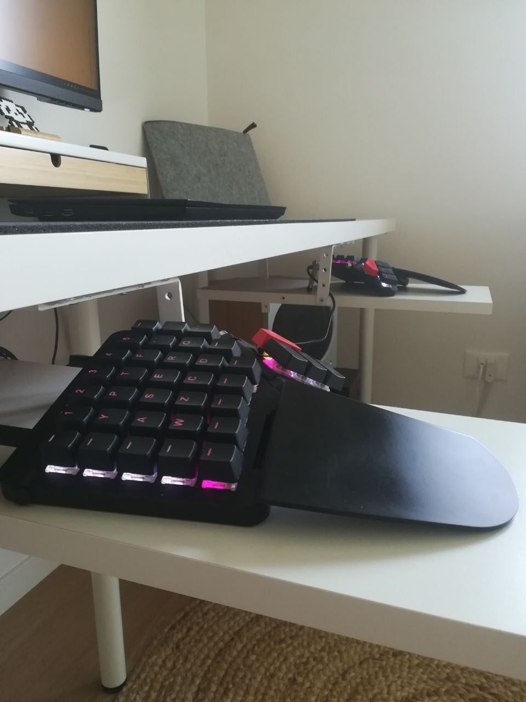

  <h1>🌕Moonlander🛰️</h1>
  <h3>Keyboard from the outer space</h3>

## Introduction

🌕Moonlander🛰️ is my keyboard configuration for the [homonymous keyboard from ZSA](
https://www.zsa.io/moonlander).

## The Story

The idea of using a orthogonal ergonomic keyboard has been floating for some time in
my mind, mainly due to health benefits that these tools provide compared, when typing,
as compared to traditional keyboards: a more open chest, a natural upper back curve,
and less finger strain.

So when I first finally got my first Moonlander keyboard, I quickly became intrigued
with the deep customization that it provided. Admittedly, health benefits became of
secondary importance, and my inner performance oriented programmer got the better of
me.

I quickly became to wonder which could be the best key layout to achieve the fastest
typing speed. I started to experiment, research, test and test layouts over again.
After two years, I can safely say that there is no substantial typing speed difference
between a super sleek Colemak or a clunky QWERTY. After all, the top typers in the world
all achieve record speeds using no less than the good ol' QWERTY.

*However*, when I was about to throw the Moonlander, and all the research, out of the
window, and switch back to my worn out USB QWERTY, I realized that the reason why I
started this journey was only about health and comfort. After all, not everything is
about performance! And the good news is that, yes, there are indeed better layouts than
QWERTY for typing with less strain and, incidentally, more precision.

With the help of this [wonderfully made web app](
https://patorjk.com/keyboard-layout-analyzer/#/main) (kudos to Patrick) I developed a
layout that aimed for those new goals, and, as you can see, it fares pretty well:

  

> You can find the layout to import on this site [here](layout.json).

Then, with some woodwork and measurements, I built the supporting wings that let me
stay in the most comfortable and healthy position while typing for long hours on the
Moonlander: these very words are coming from this setup!

If you're curious, here's what it looks like:

  
  
  

After one year of usage, I can safely say that my typing speed is exactly the same
of what it was with QWERTY, but I feel better than ever: coming back to the keyboard
has never been so pleasant!
